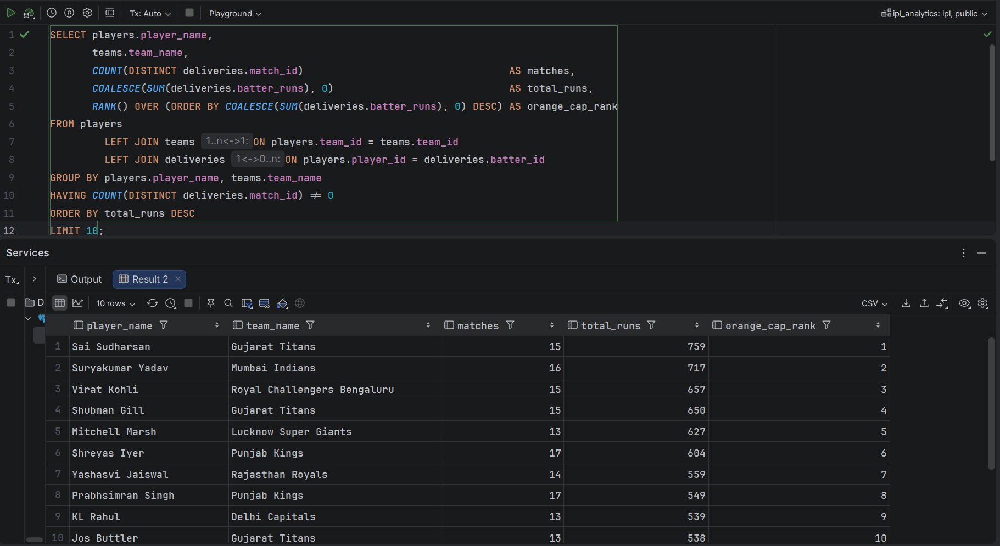
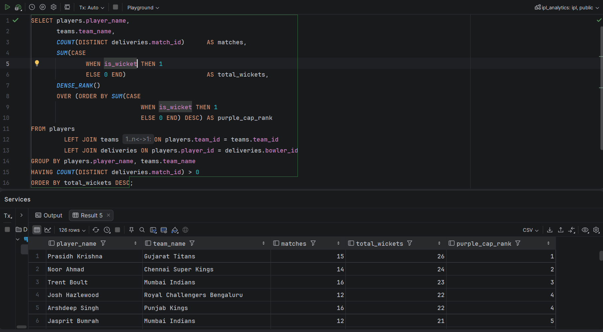
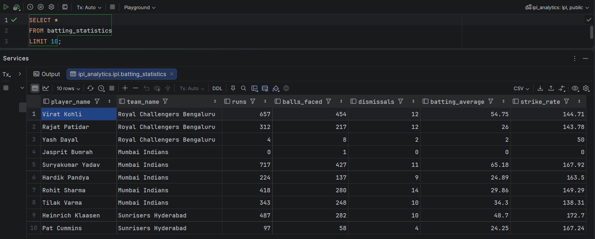
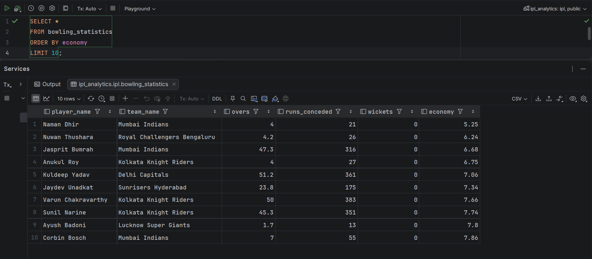
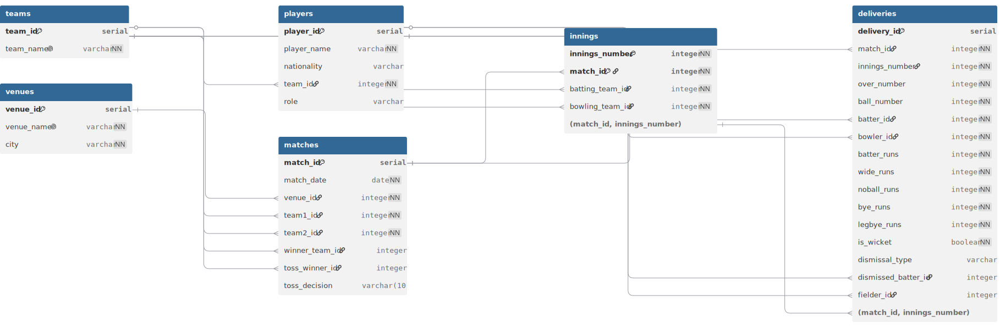

# 🏏 IPL Analytics Database


A production-style PostgreSQL database project...

# IPL Analytics Database

A PostgreSQL-based database project that models IPL cricket matches using a normalized relational schema and performs advanced analytical queries using SQL.

The project is designed to demonstrate database design, SQL proficiency, analytical querying, and query optimization concepts commonly used in backend engineering.

---

## Project Highlights

- Complete IPL 2025 relational database
- 74 matches imported
- 146 innings generated
- 17,173 ball-by-ball deliveries
- Automated Python ETL pipeline
- Advanced SQL analytics using CTEs, Views and Window Functions
- Indexed PostgreSQL schema

---

## Challenges Solved

During development several real-world data issues had to be resolved.

- Inconsistent player names between datasets
- Venue naming mismatches
- Replacement players missing from auction data
- Abandoned matches with missing toss information
- Missing innings dataset (generated programmatically)
- CSV encoding issues

---

# Sample Outputs

The following screenshots demonstrate some of the analytical views generated by the project.


## Orange Cap Leaderboard

<p align="center">

</p>

---

## Purple Cap Leaderboard

<p align="center">

</p>

---

## Batting Statistics

<p align="center">

</p>

---

## Bowling Statistics

<p align="center">

</p>

---

## Features

- Normalized relational database schema (3NF)
- Ball-by-ball IPL data model
- Sample dataset with realistic match information
- Basic analytics queries
- Intermediate & advanced analytics queries
- Common Table Expressions (CTEs)
- Window Functions
- Ranking Functions
- Conditional Aggregations
- Query Optimization (Upcoming)
- Views (Upcoming)
- Indexing (Upcoming)

---

## Tech Stack

- PostgreSQL
- SQL
- DataGrip
- Git

---

## Project Structure
```
IPL-Analytics-Database
│
├── analytics/
│   ├── 01_basic_analytics.sql
│   └── 02_intermediate_and_advanced_analytics.sql
│
├── schema/
│   ├── 01_schema_design.sql
│   ├── 02_create_tables.sql
│   └── 03_seed_data.sql
│
├── views/
│
├── explain-analysis/
│
├── data/
│
├──  README.md
└── .gitignore
```
## Database Schema

The project models the following entities:

- Teams
- Players
- Venues
- Matches
- Innings
- Deliveries

The schema is normalized to Third Normal Form (3NF) to minimize redundancy while supporting complex analytical queries.

---

# Database Schema

The database consists of six normalized tables connected through primary and foreign key relationships.

## Entity Relationship Diagram

<p align="center">
    
</p>

The schema is designed to maintain referential integrity while supporting efficient analytical queries across teams, players, matches, innings, and deliveries.

---

#  ETL Architecture

The ETL pipeline extracts IPL 2025 datasets from CSV files, performs data cleaning and normalization, loads the processed data into a PostgreSQL database, and exposes reusable SQL views and analytical queries for cricket insights.

<p align="center">
    
</p>

---

## Analytics Included

### Batting Analytics

- Highest Run Scorers
- Highest Strike Rate
- Highest Batting Average
- Most Fifties
- Most Centuries
- Boundary Percentage
- Player Performance by Venue
- Orange Cap Progression

### Bowling Analytics

- Most Wickets
- Best Economy Rate
- Best Bowling Average
- Best Bowling Strike Rate
- Purple Cap Progression

### Team Analytics

- Team Win Percentage
- Head-to-Head Record
- Toss Conversion Rate
- Batting First vs Chasing Success

### Venue Analytics

- Highest Scoring Venues

---

## SQL Concepts Demonstrated

- Joins
- Aggregate Functions
- GROUP BY & HAVING
- CASE Expressions
- Subqueries
- Common Table Expressions (CTEs)
- Window Functions
- RANK() & DENSE_RANK()
- Conditional Aggregation
- NULLIF()
- COALESCE()

---

## Future Scope

Potential future enhancements include:

- Importing complete IPL datasets
- Stored Procedures
- Triggers
- Materialized Views
- Partitioning
- Backend REST API using Spring Boot

---

## Author

**Jaiditya Sinha**

*Databases Mini Project* 
